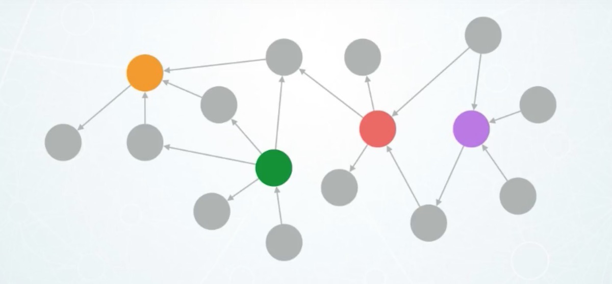
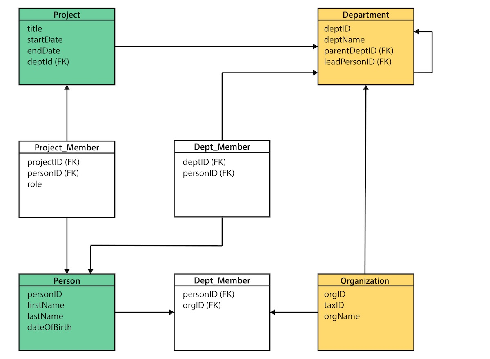
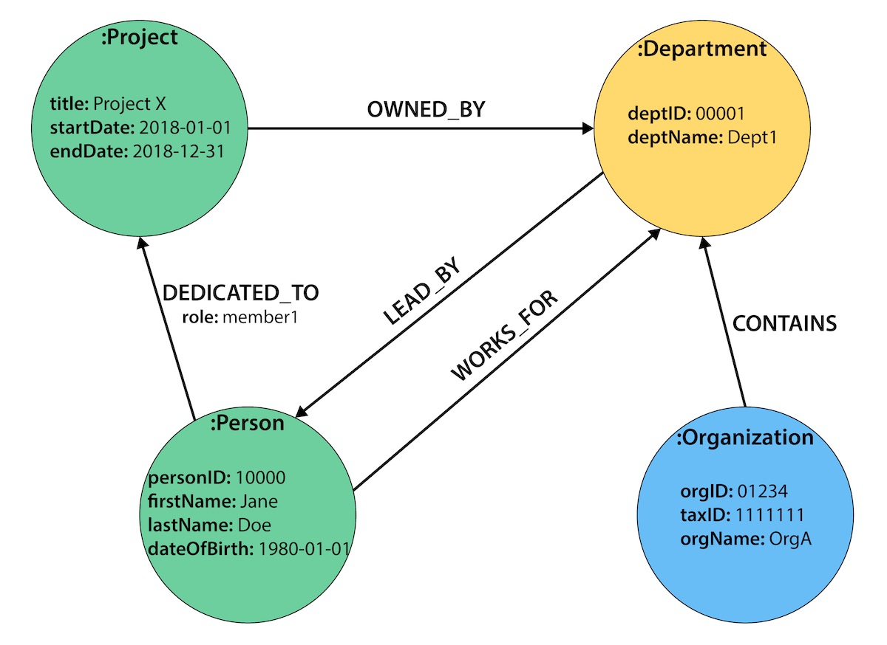

# GraphDB_AWS_Neptune_Neo4J

We live in a connected world! There are no isolated pieces of information, but rich, connected domains all around us.

*Welcome to the Real world of System-Of-Engagements*

**Welcome to world of GraphDB!!**

- Graph databases **natively embraces relationships**. 
- While other databases compute **relationships at query time** through **expensive JOIN operations**, a Graph database stores **connections alongside the data** in the model.
- The Property Graph Model: A *Node-Edges-Properties model* to *organize Domain Data and their inherent relationships*. A quick glimpse of Property Graph Model- 
  
|Relational Model | Graph Model|
| :--: | :--: |
|||
|Please click on the above image to expand|Please click on the above image to expand|   

- Independent of the total size of your dataset, graph databases excel at managing highly-connected data and complex queries.
- Graph DB is used for very many types of Use Cases (*not* just for *Social Graph* or *Recommendation engine*), such as 
	- **MASTER DATA MANAGEMENT**
	- **GRAPH BASED SEARCH**
	- **REAL TIME RECOMMENDATIONS**
	- **SOCIAL NETWORK**
	- **FRAUD DETECTION**
	- **Google Maps and Routes APIs**
	- **NETWORK & IT-OPERATIONS**
	- **IDENTITY & ACCESS MANAGEMENT**
	- **System-Of-Engagements**

- Graph DB Offers over other RDMBS as well as NOSQL DBs
	- Intuitiveness
	- Speed
	- Agility
**graphs are the most natural way to model data in the real world.**

Please relish [Video](https://www.youtube.com/watch?v=JaATpaGDNh4) to understand the aforementioned high level concepts in a better way.

#### The Quick rundown of this repo
***
**Please note:** 

 	- ***This page serve as the Index page.***
	- Please click on hyperlinks of the respective items to delve deep into it.
	- Please keep checking your **compass (this index page)** for to seamlessly steer your way to the next mile of this wonderful journey.
***
 
- [Tranformation from RDBMS Model Schema to Graph Data Model](README%20-Data%20Model%20Transformation.md)
- [AWS Neptune vis-a-vis Neo4j]()
- [Polymorphysm in AWS Neptune]()
- [Deep dive into AWS Neptune Property GraphDB]()
	- [Setting up AWS Neptune]()
	- [Bulk Loading Data into AWS Neptune]()
	- [Gremlin Query on AWS Neptune]()
	- [Writing to Amazon Neptune from Amazon Kinesis Data Streams]()
	- [Production garde Data pipeline with Neptune as Data Sink]()
	- [Visualize data in Amazon Neptune using VIS.js]()

## AWS Neptune Property GraphDB Codesets
Following folders carry **Jupyter notebook (interactive python notebook/ .ipynb)** || **Python Codeset as well as pseudocode** ||  **refernce blogs** et al.

  
- **[AWS Neptune Cluster setup](neptune)** 

- **[Visualize data in Amazon Neptune using VIS.js](https://github.com/DeepHiveMind/AWS_GraphDB_AWS-API-GW_AWS-Lambda_Visualization_Pipeline)**
